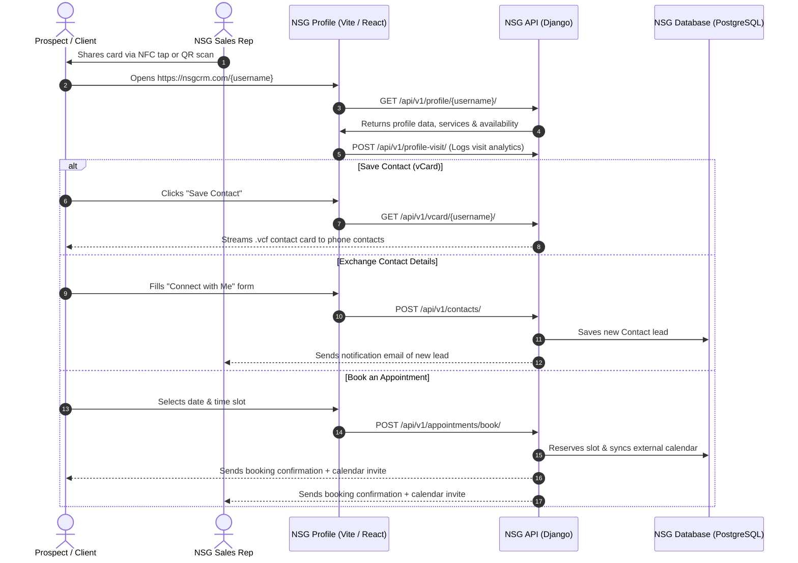

# NSG CRM (Network Sales & Growth) — Product Brief & Architecture Overview

---

## 1. Executive Summary

**NSG CRM (Network Sales & Growth)** is a modern, white-labeled, full-stack Customer Relationship Management (CRM) and digital networking platform. It bridges the gap between physical in-person networking, digital identity, and automated sales pipeline management.

Designed for sales professionals, advisors, consultants, real estate brokers, and enterprise teams, NSG CRM replaces static paper business cards and fragmented scheduling tools with an integrated engine for:
1. **Interactive Digital Business Cards (NFC / QR / Web)**
2. **Contact & Lead Pipeline Management**
3. **Automated Appointment Scheduling & Calendar Synchronization**
4. **Team & Multi-tenant Brand Governance**
5. **Subscription & Monetization Management**

---

## 2. Core Value Proposition

| Pain Point in Traditional Sales | How NSG CRM Solves It |
| :--- | :--- |
| **Lost Leads from Paper Cards**: 88% of paper business cards are discarded within a week. | **Instant Contact Exchange**: Tap an NFC card or scan a QR code to download an interactive contact card (vCard), view rich portfolios, and capture lead details immediately. |
| **Fragmented Tooling**: Juggling Calendly for booking, HubSpot for CRM, and Linktree for links. | **All-in-One Workspace**: Digital profile, lead capture, calendar booking, and CRM pipeline live in a single unified dashboard. |
| **Brand Inconsistency Across Teams**: Individual reps using disparate links, unapproved messaging, or outdated branding. | **Centralized Team Portals**: Admins manage team profiles, enforce unified branding, allocate smart cards, and view aggregated team performance. |
| **Privacy & Tracking Concerns**: Bloated trackers and third-party ad pixels leaking customer data. | **Zero Third-Party Ad Trackers**: Engineered strictly for business observability and direct CRM relationships—no Facebook, Google, or TikTok tracking pixels. |

---

## 3. Key Feature Pillars

```
+-------------------------------------------------------------------------------+
|                                  NSG CRM                                      |
+-------------------+-------------------+-------------------+-------------------+
|  1. Digital Cards |   2. Smart CRM    |   3. Scheduling   |  4. Team / Admin  |
|  & NFC Profiles   |    & Pipeline     |   & Availability  |    Governance     |
+-------------------+-------------------+-------------------+-------------------+
| - Dynamic QR code | - Contact cards   | - Booking links   | - Multi-user orgs |
| - vCard download  | - Activity logs   | - Calendar sync   | - Role permissions|
| - Custom branding | - Tags & stages   | - Email reminders | - Team analytics  |
| - Rich media links| - CSV import/exp. | - Buffer times    | - Card allocation |
+-------------------+-------------------+-------------------+-------------------+
```

### 3.1. Digital Business Cards & Smart NFC Profiles
* **Dynamic Web Profiles**: Personalized, responsive landing page showcasing avatar, title, company, bio, social channels, custom links, featured services, and video introductions.
* **One-Tap vCard Download**: Direct integration with iOS Contacts and Android Google Contacts via `.vcf` export.
* **NFC & QR Generation**: High-resolution, dynamic QR codes and direct NFC payload routing to user profile URLs (`/{username}`).
* **Lead Capture Mode**: Optional capture modal prompting profile visitors to exchange their contact info before accessing documents or links.

### 3.2. Contact & Lead Management (CRM)
* **Central Contact Repository**: Full history of captured prospects, notes, communication logs, and tags.
* **Interaction History**: Automatic logging of when a contact was created, profile visits, and booked appointments.
* **Tagging & Segmentation**: Categorize leads by industry, event, status (New, Contacted, Qualified, Closed), and follow-up priority.
* **Bulk Operations**: Seamless CSV import and export for integration with enterprise backends.

### 3.3. Appointment & Calendar Scheduling
* **Self-Serve Booking Page**: Integrated directly into the user's digital profile—clients can book meetings without leaving the card.
* **Configurable Availability**: Weekly time slots, custom date overrides, meeting buffer times, and minimum notice periods.
* **Two-Way Calendar Sync**: Integrations with Google Calendar and Microsoft Outlook to eliminate double bookings.
* **Automated Confirmations**: System-generated HTML email invites and calendar `.ics` attachments sent to both organizer and attendee.

### 3.4. Team & Enterprise Governance
* **Hierarchical Organizations**: Company accounts with dedicated admin dashboards to manage sales reps and consultants.
* **Brand Templates**: Lock corporate color schemes, official logos, and standardized disclosure links across all employee cards.
* **Team Analytics**: Track profile views, contact downloads, and lead acquisition rates across individuals and departments.

### 3.5. Subscriptions & Billing
* **Tiered Subscription Plans**: Free, Professional, and Enterprise tiers gating premium features (custom domains, unlimited cards, advanced scheduling, analytics).
* **Payment Integration**: Secure subscription handling via Stripe Checkout and Customer Portal.

---

## 4. End-to-End User Journey



---

## 5. Technical Architecture & Stack

```
+-----------------------------------------------------------------------+
|                            Client Layer                               |
|   - Mobile Browsers (iOS / Android)                                   |
|   - Desktop Browsers (Chrome / Safari / Firefox / Edge)               |
+-----------------------------------------------------------------------+
                                  │
                                  ▼
+-----------------------------------------------------------------------+
|                           Frontend (SPA)                              |
|   - React 18, Vite 5 build system                                     |
|   - React Router DOM v6                                               |
|   - Tailwind CSS / Modular Stylesheets                                |
|   - Optimized asset loading (sub-300ms HMR dev boot)                  |
+-----------------------------------------------------------------------+
                                  │
                          REST API (JSON)
                                  │
                                  ▼
+-----------------------------------------------------------------------+
|                          Backend API (Django)                         |
|   - Django 4.2 LTS + Django REST Framework (DRF)                      |
|   - Whitenoise (serves compiled Vite production bundle)               |
|   - Dynamic Open Graph / SEO meta injection (views.index)             |
|   - Authentication: Knox token / Session auth                         |
|   - Third-Party APIs: Stripe, Google Calendar, Outlook API            |
+-----------------------------------------------------------------------+
                                  │
                  ┌───────────────┴───────────────┐
                  ▼                               ▼
+-----------------------------------+   +-------------------------------+
|         Primary Database          |   |        Cache & Storage        |
|   - PostgreSQL (ACID compliant)   |   |   - Redis (Cache / Sessions)  |
|   - Relational CRM schema         |   |   - AWS S3 / Cloud Storage    |
+-----------------------------------+   +-------------------------------+
```

### 5.1. Backend Specifications
* **Framework**: Python 3.11+ / Django 4.2 LTS / Django REST Framework.
* **Database**: PostgreSQL with consolidated schema migrations (`api/migrations/0001_initial.py`).
* **Static / Media Serving**: Whitenoise for the compiled frontend SPA; AWS S3 / GCS for user uploads (avatars, logos, documents).
* **Security & Auth**: Token-based authentication via `django-rest-knox`, CORS header restrictions, and encrypted secrets loading via `.env`.

### 5.2. Frontend Specifications
* **Framework**: React 18 SPA bundled via Vite 5.
* **Routing**: Dynamic client-side routing with `react-router-dom`.
* **State & Networking**: Axios with centralized base URL configuration (`frontend/src/config.js`).
* **Build Targets**: Production output compiled into `frontend/build/`, served directly by Django Whitenoise in monolithic deployments.

---

## 6. Security, Compliance & White-Labeling Standards

1. **Zero Third-Party Trackers**:
   * Completely purged of behavioral tracking scripts (Google Tag Manager, Meta Pixel, TikTok Pixel, Microsoft Clarity, Hotjar, Trackdesk).
   * No outbound marketing telemetry; customer contact records remain strictly proprietary to the account holder.
2. **Strict White-Labeling**:
   * Standardized company naming: **Network Sales & Growth (NSG)**.
   * Brand assets, logos, and favicons maintained in `frontend/public/` and `templates/`.
3. **Audit & Access Control**:
   * Role-based permissions across User, Admin, and Superuser levels.
   * Sensitive credentials managed via environment variables and never checked into source control.

---

## 7. How to Run the System

### Backend Setup
```bash
# 1. Activate virtual environment
source venv/bin/activate

# 2. Install dependencies
pip install -r requirements.txt

# 3. Check models & database sanity
python manage.py check --tag models

# 4. Apply migrations
python manage.py migrate

# 5. Seed initial system data
python manage.py seed_initial_data

# 6. Start development server
python manage.py runserver 8000
```

### Frontend Setup
```bash
# 1. Navigate to frontend directory
cd frontend

# 2. Install dependencies
npm install --legacy-peer-deps

# 3. Start Vite development server (port 3000)
npm start

# 4. Build for production (outputs to frontend/build/)
npm run build
```

